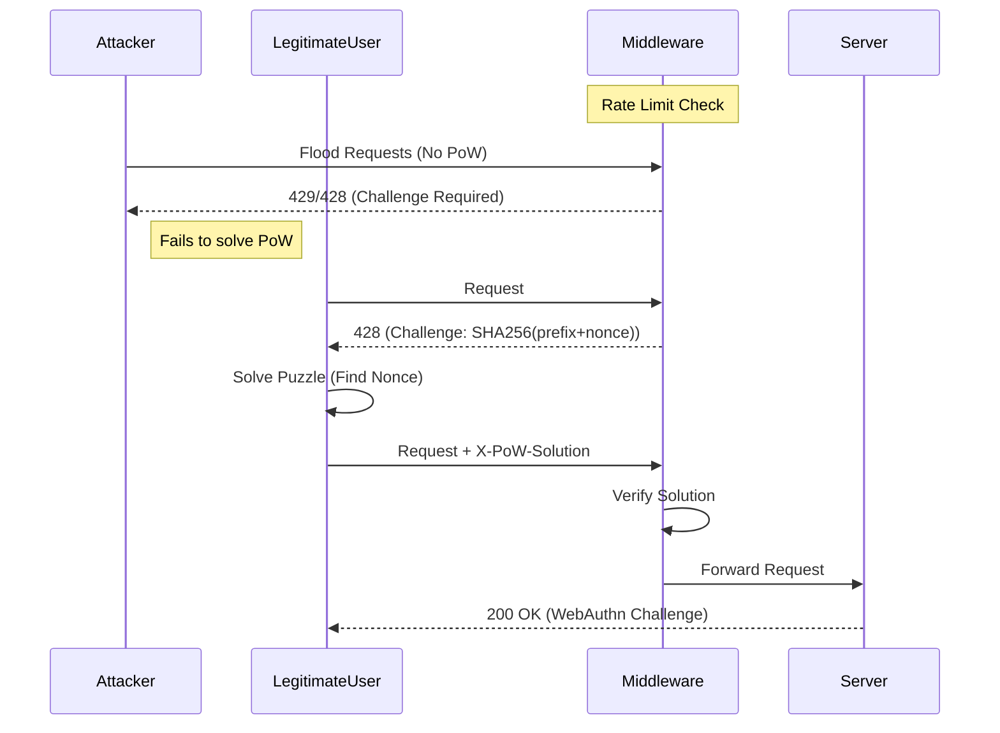

# 🛡️ Biometric DoS Defense PoC

> **Proof of Concept for "Comprehensive Approach to Web Resource Protection: Integrating Biometric MFA and Authentication Perimeter Protection against DoS Attacks"**


## 📖 Overview

This project demonstrates a robust defense mechanism against **Layer 7 Denial of Service (DoS)** attacks targeting resource-intensive endpoints, specifically **WebAuthn (Biometric) Login Initialization**.

Cryptographic operations required for WebAuthn handshakes are computationally expensive. An attacker can exploit this by flooding the server with initialization requests, exhausting CPU resources and denying service to legitimate users.

This PoC implements a **Defense Middleware** that shifts the computational burden to the client using an **Adaptive Proof-of-Work (PoW)** mechanism combined with **IP-based Rate Limiting**.

---

## 🚀 Key Features

*   **🎯 Vulnerable Target Simulation**: A mock server endpoint (`/auth/webauthn/begin`) that simulates high CPU usage (SHA-256 hashing loop).
*   **🛡️ Defense Middleware**:
    *   **Rate Limiting**: Token bucket algorithm to handle bursts and steady traffic.
    *   **Adaptive Proof-of-Work**: Dynamically challenges clients with a computational puzzle when rate limits are exceeded.
*   **⚔️ Attacker Simulator**: A CLI tool to simulate:
    *   **Dumb Flood**: High-volume attacks ignoring protocol (quickly rejected).
    *   **Smart Flood**: "Legitimate" users who solve puzzles to gain access.

---

## 🏗️ Architecture



---

## 🛠️ Getting Started

### Prerequisites

*   [Go 1.23+](https://go.dev/dl/)

### Installation

1.  Clone the repository:
    ```bash
    git clone https://github.com/yourusername/biometric-dos-defense-poc.git
    cd biometric-dos-defense-poc
    ```
2.  Install dependencies:
    ```bash
    go mod tidy
    ```

---

## 🎮 Usage

### 1. Start the Server
The server runs on port `8080` and exposes the protected endpoint and metrics.

```bash
go run cmd/server/main.go
```

### 2. Run the Attacker
Open a new terminal to run the attacker CLI.

**Mode A: Dumb Flood (DoS Attempt)**
Simulates a botnet flooding the server without solving puzzles.
```bash
go run cmd/attacker/main.go -mode dumb -c 50 -d 10s
```
*   **Expected Result**: High number of `428/429` responses. Server CPU remains low.

**Mode B: Smart Flood (Legitimate Traffic)**
Simulates users who are willing to "pay" the CPU cost to login.
```bash
go run cmd/attacker/main.go -mode smart -c 5 -d 10s
```
*   **Expected Result**: Successful `200 OK` responses. Slower request rate due to client-side solving time.

### 3. Check Metrics
View real-time statistics of processed vs. dropped requests.

```bash
curl http://localhost:8080/metrics
```

---

## 📂 Project Structure

```
.
├── cmd
│   ├── attacker    # Load generator CLI
│   └── server      # Main server application
├── internal
│   ├── middleware  # Defense logic (Rate Limit + PoW)
│   ├── pow         # Proof of Work puzzle generation/verification
│   └── server      # Vulnerable handler implementation
├── go.mod          # Dependencies
└── README.md       # Documentation
```

## 🧠 How It Works

1.  **Request Ingress**: All requests to `/auth/webauthn/begin` pass through the `DefenseMiddleware`.
2.  **Rate Check**: The middleware checks the IP against a token bucket.
    *   **Under Limit**: Request passes through immediately.
    *   **Over Limit**: Middleware returns `428 Precondition Required` with a JSON payload containing a random `prefix` and `difficulty`.
3.  **Client Solver**: The client must find a `nonce` such that `SHA256(prefix + nonce)` has `N` leading zero bits.
4.  **Verification**: The client resends the request with `X-PoW-Solution: prefix:nonce`. The middleware verifies the hash and allows the request if valid, bypassing the rate limiter for this specific request.

---

## 📝 License

This project is licensed under the MIT License.
